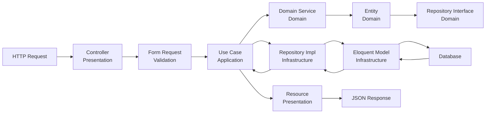

# 🏗️ Visão Geral da Arquitetura

## Introdução

O He4rtBot Discord API é construído seguindo os princípios de **Domain-Driven Design (DDD)**, promovendo:

- ✅ Separação clara de responsabilidades
- ✅ Código testável e manutenível
- ✅ Baixo acoplamento entre módulos
- ✅ Alta coesão dentro dos módulos
- ✅ Independência de frameworks e bibliotecas externas

## 🎯 Princípios Arquiteturais

### 1. Domain-Driven Design (DDD)

O sistema é organizado em **Bounded Contexts** (contextos delimitados), cada um representando um módulo de domínio específico.

```
Heart/
├── Authentication/     # Contexto de Autenticação
├── User/              # Contexto de Usuários
├── Badges/            # Contexto de Badges
├── Ranking/           # Contexto de Rankings
├── Season/            # Contexto de Temporadas
├── Meeting/           # Contexto de Meetings
├── Feedback/          # Contexto de Feedback
├── Message/           # Contexto de Mensagens
├── Character/         # Contexto de Personagens
├── Provider/          # Contexto de Provedores
├── Integrations/      # Integrações Externas
└── Core/              # Recursos Compartilhados
```

### 2. Clean Architecture

Cada módulo segue a estrutura de **Clean Architecture** com camadas bem definidas:

```
ModuleName/
├── Application/           # Camada de Aplicação
│   ├── UseCases/         # Casos de uso (lógica de aplicação)
│   ├── Services/         # Serviços de aplicação
│   └── DTOs/             # Data Transfer Objects
│
├── Domain/               # Camada de Domínio (núcleo)
│   ├── Entities/         # Entidades de domínio
│   ├── ValueObjects/     # Objetos de valor
│   ├── Repositories/     # Interfaces de repositórios
│   ├── Events/           # Eventos de domínio
│   ├── Exceptions/       # Exceções de domínio
│   └── Services/         # Serviços de domínio
│
├── Infrastructure/       # Camada de Infraestrutura
│   ├── Persistence/      # Persistência de dados
│   │   ├── Models/       # Eloquent Models
│   │   └── Repositories/ # Implementações de repositórios
│   ├── Http/            # Clientes HTTP
│   └── External/        # Integrações externas
│
└── Presentation/        # Camada de Apresentação
    ├── Controllers/     # Controllers HTTP
    ├── Resources/       # API Resources
    └── Requests/        # Form Requests
```

### 3. Dependência Invertida

As dependências **sempre apontam para dentro**:

```
Presentation → Application → Domain ← Infrastructure
                    ↓
                  Core
```

- **Domain** não conhece nenhuma outra camada
- **Application** conhece apenas Domain
- **Infrastructure** implementa interfaces definidas em Domain
- **Presentation** orquestra Application e Infrastructure

## 🔄 Fluxo de Dados

### Request Flow



### Exemplo Prático: Criar Usuário

```php
// 1. Request chega no Controller (Presentation)
class UserController extends Controller
{
    public function __construct(
        private readonly CreateUserUseCase $createUser
    ) {}

    public function store(CreateUserRequest $request): JsonResponse
    {
        // 2. Request validado e convertido em DTO
        $userData = UserDTO::fromRequest($request);
        
        // 3. Use Case é executado
        $user = $this->createUser->execute($userData);
        
        // 4. Response formatado e retornado
        return response()->json(
            new UserResource($user),
            201
        );
    }
}

// 5. Use Case orquestra a lógica (Application)
class CreateUserUseCase
{
    public function __construct(
        private readonly UserRepositoryInterface $userRepository,
        private readonly EventDispatcherInterface $eventDispatcher
    ) {}

    public function execute(UserDTO $data): User
    {
        // 6. Entidade de domínio é criada
        $user = User::create(
            discordId: $data->discordId,
            username: $data->username,
            discriminator: $data->discriminator
        );
        
        // 7. Validações de domínio são aplicadas
        $user->validateDiscordId();
        
        // 8. Persistência através da interface
        $savedUser = $this->userRepository->save($user);
        
        // 9. Evento de domínio é disparado
        $this->eventDispatcher->dispatch(
            new UserCreatedEvent($savedUser)
        );
        
        return $savedUser;
    }
}

// 10. Repositório implementa a interface (Infrastructure)
class EloquentUserRepository implements UserRepositoryInterface
{
    public function save(User $user): User
    {
        $model = UserModel::create([
            'discord_id' => $user->getDiscordId(),
            'username' => $user->getUsername(),
            'discriminator' => $user->getDiscriminator(),
        ]);
        
        return $this->toDomain($model);
    }
}
```

## 🧱 Componentes Principais

### 1. Entities (Entidades)

Objetos com identidade única que encapsulam lógica de negócio.

```php
namespace Heart\User\Domain\Entities;

class User
{
    private function __construct(
        private readonly UserId $id,
        private DiscordId $discordId,
        private Username $username,
        private Discriminator $discriminator,
        private Experience $experience,
    ) {}

    public static function create(
        string $discordId,
        string $username,
        string $discriminator
    ): self {
        return new self(
            id: UserId::generate(),
            discordId: DiscordId::from($discordId),
            username: Username::from($username),
            discriminator: Discriminator::from($discriminator),
            experience: Experience::zero(),
        );
    }

    public function earnExperience(int $amount): void
    {
        $this->experience = $this->experience->add($amount);
        
        if ($this->experience->hasLeveledUp()) {
            $this->applyLevelUpRewards();
        }
    }

    public function validateDiscordId(): void
    {
        if (!$this->discordId->isValid()) {
            throw new InvalidDiscordIdException();
        }
    }
}
```

### 2. Value Objects

Objetos sem identidade definidos por seus valores.

```php
namespace Heart\User\Domain\ValueObjects;

final readonly class Experience
{
    private function __construct(
        private int $points,
        private int $level
    ) {}

    public static function zero(): self
    {
        return new self(0, 1);
    }

    public static function from(int $points): self
    {
        $level = self::calculateLevel($points);
        return new self($points, $level);
    }

    public function add(int $amount): self
    {
        return new self(
            $this->points + $amount,
            self::calculateLevel($this->points + $amount)
        );
    }

    public function hasLeveledUp(): bool
    {
        $newLevel = self::calculateLevel($this->points);
        return $newLevel > $this->level;
    }

    private static function calculateLevel(int $points): int
    {
        return (int) floor(sqrt($points / 100));
    }
}
```

### 3. Repositories (Interfaces)

Abstrações para persistência de dados.

```php
namespace Heart\User\Domain\Repositories;

interface UserRepositoryInterface
{
    public function save(User $user): User;
    
    public function findById(UserId $id): ?User;
    
    public function findByDiscordId(DiscordId $discordId): ?User;
    
    public function delete(UserId $id): void;
    
    public function getTopByExperience(int $limit): Collection;
}
```

### 4. Use Cases

Orquestram a lógica de aplicação.

```php
namespace Heart\User\Application\UseCases;

final class EarnDailyRewardUseCase
{
    public function __construct(
        private readonly UserRepositoryInterface $userRepository,
        private readonly DailyRewardPolicy $dailyRewardPolicy,
        private readonly EventDispatcherInterface $eventDispatcher
    ) {}

    public function execute(string $discordId): DailyRewardResult
    {
        $user = $this->userRepository->findByDiscordId(
            DiscordId::from($discordId)
        );

        if (!$user) {
            throw new UserNotFoundException($discordId);
        }

        if (!$this->dailyRewardPolicy->canClaim($user)) {
            throw new DailyRewardAlreadyClaimedException();
        }

        $reward = $this->dailyRewardPolicy->calculateReward($user);
        $user->earnExperience($reward->getExperience());
        $user->markDailyRewardClaimed();

        $this->userRepository->save($user);

        $this->eventDispatcher->dispatch(
            new DailyRewardClaimedEvent($user, $reward)
        );

        return DailyRewardResult::success($reward);
    }
}
```

### 5. Domain Events

Comunicação entre módulos.

```php
namespace Heart\User\Domain\Events;

final readonly class UserLeveledUpEvent
{
    public function __construct(
        public UserId $userId,
        public int $previousLevel,
        public int $newLevel,
        public \DateTimeImmutable $occurredAt
    ) {}
}
```

## 🔗 Comunicação Entre Módulos

### Event-Driven Communication

Módulos se comunicam através de **Domain Events**:

```php
// User Module dispara evento
$this->eventDispatcher->dispatch(
    new UserLeveledUpEvent($user->getId(), $oldLevel, $newLevel)
);

// Badge Module ouve o evento
class AwardBadgeOnLevelUpListener
{
    public function handle(UserLeveledUpEvent $event): void
    {
        if ($event->newLevel === 10) {
            $this->awardBadgeUseCase->execute(
                userId: $event->userId,
                badgeType: BadgeType::LEVEL_10
            );
        }
    }
}
```

### Dependency Injection

Módulos dependem de **interfaces**, não de implementações:

```php
// Use Case depende da interface
class GetUserRankingUseCase
{
    public function __construct(
        private readonly UserRepositoryInterface $userRepository,
        private readonly SeasonServiceInterface $seasonService // Interface de outro módulo
    ) {}
}
```

## 🛡️ Padrões Utilizados

### Estratégicos (DDD)
- **Bounded Context**: Cada módulo é um contexto delimitado
- **Ubiquitous Language**: Linguagem compartilhada no código
- **Context Mapping**: Relações entre contextos definidas

### Táticos (DDD)
- **Entities**: Objetos com identidade
- **Value Objects**: Objetos sem identidade
- **Aggregates**: Clusters de entidades
- **Repositories**: Abstração de persistência
- **Domain Services**: Lógica que não pertence a entidades
- **Domain Events**: Notificações de mudanças

### Design Patterns
- **Repository Pattern**: Abstração de dados
- **Factory Pattern**: Criação de objetos complexos
- **Strategy Pattern**: Algoritmos intercambiáveis
- **Observer Pattern**: Event Listeners
- **Dependency Injection**: Inversão de controle
- **DTO Pattern**: Transferência de dados

## 📏 Convenções e Regras

### Nomenclatura

```php
// Entidades: substantivos no singular
User, Badge, Meeting

// Use Cases: verbo + substantivo + UseCase
CreateUserUseCase, ClaimBadgeUseCase

// Repositories: substantivo + RepositoryInterface
UserRepositoryInterface, BadgeRepositoryInterface

// Events: substantivo + verbo no passado + Event
UserCreatedEvent, BadgeClaimed Event

// Value Objects: substantivo descritivo
DiscordId, Username, Experience
```

### Regras de Negócio

> ✅ **Regras de negócio SEMPRE na camada de Domain**

```php
// ✅ Correto: Lógica no Domain
class User
{
    public function canClaimDailyReward(): bool
    {
        return $this->lastDailyClaim === null 
            || $this->lastDailyClaim->diffInHours(now()) >= 24;
    }
}

// ❌ Errado: Lógica no Controller
class UserController
{
    public function claimDaily(Request $request)
    {
        if ($user->last_daily_claim 
            && Carbon::parse($user->last_daily_claim)->diffInHours() < 24) {
            return response()->json(['error' => 'Too soon'], 400);
        }
    }
}
```

## 🔍 Benefícios da Arquitetura

### Testabilidade
```php
// Fácil de testar com mocks
$mockRepository = $this->createMock(UserRepositoryInterface::class);
$useCase = new CreateUserUseCase($mockRepository);
```

### Manutenibilidade
- Mudanças isoladas em módulos específicos
- Impacto limitado de alterações
- Código auto-documentado

### Escalabilidade
- Módulos podem ser extraídos para microserviços
- Fácil adicionar novos módulos
- Paralelização de desenvolvimento

### Independência de Framework
- Lógica de negócio não depende do Laravel
- Possível migrar para outro framework
- Core business logic preservado

## 📚 Recursos Adicionais

- [Módulos Detalhados](./modules.md)
- [Padrões de Código](../development/code-standards.md)
- [Guia de Testes](../testing/guide.md)

---

> 💡 **Dica**: Ao adicionar novas funcionalidades, sempre comece pelo Domain. Defina as entidades, value objects e regras de negócio antes de pensar em persistência ou apresentação.
