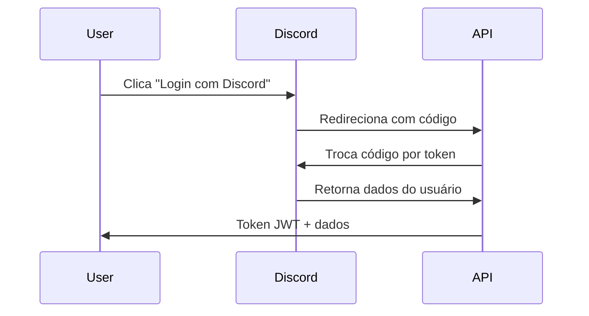

# 🔌 Integrações Externas

## Visão Geral

O He4rtBot API integra-se com diversos serviços externos para fornecer funcionalidades completas.

## 🎮 Integração Discord

### Discord.js Bot

O bot Discord é o principal cliente da API.

**Repositório:** `he4rt/he4rt-bot-discord`

### Autenticação OAuth

#### Fluxo de Autenticação



#### Configuração

```env
DISCORD_CLIENT_ID=your_client_id
DISCORD_CLIENT_SECRET=your_client_secret
DISCORD_REDIRECT_URI=https://api.heartdevs.com/api/auth/discord/callback
DISCORD_BOT_TOKEN=your_bot_token
```

#### Endpoints OAuth

```http
# Iniciar autenticação
GET /api/auth/discord/redirect

# Callback do Discord
GET /api/auth/discord/callback?code={code}

# Refresh token
POST /api/auth/refresh
```

### Bot Commands Integration

#### Webhook para Comandos

O bot envia comandos via webhook:

```http
POST /api/webhooks/discord/commands
X-Bot-Token: {bot_token}
Content-Type: application/json
```

**Request:**
```json
{
  "command": "rank",
  "user_id": "123456789",
  "channel_id": "987654321",
  "guild_id": "111222333",
  "args": ["@usuario"]
}
```

**Response:**
```json
{
  "success": true,
  "reply": {
    "content": "🏆 **Ranking de @usuario**\n\nNível: 42\nXP: 125,000\nPosição: #1",
    "embed": {
      "title": "Ranking",
      "color": 0xFF6B6B,
      "fields": [...]
    }
  }
}
```

### Event Listeners

#### Mensagens do Discord

```http
POST /api/webhooks/discord/message
X-Bot-Token: {bot_token}
```

**Request:**
```json
{
  "message_id": "888999000",
  "user_id": "123456789",
  "channel_id": "987654321",
  "content": "Mensagem do usuário",
  "has_code_block": true,
  "attachments": []
}
```

**Response:**
```json
{
  "success": true,
  "data": {
    "xp_earned": 30,
    "level_up": false,
    "new_badges": []
  }
}
```

#### Reactions

```http
POST /api/webhooks/discord/reaction
X-Bot-Token: {bot_token}
```

**Request:**
```json
{
  "message_id": "888999000",
  "user_id": "123456789",
  "emoji": "❤️",
  "action": "add"
}
```

### Notificações do Bot

#### Enviar Notificação

```http
POST /api/notifications/send
Authorization: Bearer {token}
```

**Request:**
```json
{
  "user_id": 1,
  "channel": "discord_dm",
  "title": "🎉 Você subiu de nível!",
  "message": "Parabéns! Você alcançou o nível 10.",
  "embed": {
    "color": 0x00FF00,
    "thumbnail": "https://...",
    "fields": [
      {
        "name": "Novo Nível",
        "value": "10",
        "inline": true
      }
    ]
  }
}
```

## 📧 Integração Email

### SMTP Configuration

```env
MAIL_MAILER=smtp
MAIL_HOST=smtp.mailtrap.io
MAIL_PORT=2525
MAIL_USERNAME=your_username
MAIL_PASSWORD=your_password
MAIL_ENCRYPTION=tls
MAIL_FROM_ADDRESS=noreply@heartdevs.com
MAIL_FROM_NAME="He4rtBot"
```

### Email Templates

#### Welcome Email

Enviado quando novo usuário se registra.

```php
Mail::to($user->email)->send(new WelcomeEmail($user));
```

#### Meeting Reminder

Enviado 24h antes de um meeting.

```php
Mail::to($participants)->send(new MeetingReminderEmail($meeting));
```

#### Feedback Status

Enviado quando feedback muda de status.

```php
Mail::to($feedback->author)->send(new FeedbackStatusEmail($feedback));
```

## 🔔 Webhooks Externos

### Registrar Webhook

```http
POST /api/webhooks
Authorization: Bearer {token}
```

**Request:**
```json
{
  "url": "https://your-service.com/webhook",
  "events": ["user.level_up", "meeting.created"],
  "secret": "your_secret_key"
}
```

### Eventos Disponíveis

```
# Usuários
user.created
user.level_up
user.badge_earned

# Meetings
meeting.created
meeting.started
meeting.completed

# Feedbacks
feedback.created
feedback.approved
feedback.implemented

# Ranking
ranking.updated
season.started
season.ended
```

### Payload do Webhook

```json
{
  "event": "user.level_up",
  "timestamp": "2025-10-26T15:30:00Z",
  "data": {
    "user_id": 1,
    "old_level": 9,
    "new_level": 10,
    "xp": 5000
  },
  "signature": "sha256=..."
}
```

### Validar Assinatura

```php
$signature = hash_hmac(
    'sha256',
    $request->getContent(),
    $webhook->secret
);

$isValid = hash_equals(
    $signature,
    $request->header('X-Webhook-Signature')
);
```

## 📊 Sentry (Error Tracking)

### Configuração

```env
SENTRY_LARAVEL_DSN=https://...@sentry.io/...
SENTRY_TRACES_SAMPLE_RATE=0.2
```

### Captura Automática

```php
// Erros são automaticamente enviados ao Sentry
try {
    // código
} catch (Exception $e) {
    report($e); // Envia para Sentry
    throw $e;
}
```

### Context Customizado

```php
Sentry\configureScope(function (Scope $scope) use ($user) {
    $scope->setUser([
        'id' => $user->id,
        'username' => $user->username,
        'email' => $user->email,
    ]);
    
    $scope->setTag('environment', config('app.env'));
});
```

## 📈 Analytics

### Google Analytics

Integração via `analytics.js` no frontend.

```javascript
gtag('event', 'level_up', {
  'event_category': 'engagement',
  'event_label': 'Level 10',
  'value': 10
});
```

### Custom Events

```http
POST /api/analytics/event
Authorization: Bearer {token}
```

**Request:**
```json
{
  "event_name": "feature_used",
  "category": "gamification",
  "label": "badge_unlocked",
  "value": 1,
  "metadata": {
    "badge_id": 5,
    "badge_name": "Lenda"
  }
}
```

## 🗄️ Cache (Redis)

### Configuração

```env
REDIS_HOST=redis
REDIS_PASSWORD=null
REDIS_PORT=6379
REDIS_DB=0
```

### Estratégias de Cache

#### User Data Cache

```php
Cache::remember("user:{$userId}", 3600, function () use ($userId) {
    return User::with(['badges', 'stats'])->find($userId);
});
```

#### Ranking Cache

```php
Cache::remember('ranking:top100', 1800, function () {
    return User::orderBy('xp', 'desc')
        ->limit(100)
        ->get();
});
```

#### Invalidação

```php
// Ao atualizar usuário
Cache::forget("user:{$user->id}");
Cache::forget('ranking:top100');
```

## 📦 Queue (Jobs Assíncronos)

### Configuração

```env
QUEUE_CONNECTION=redis
QUEUE_FAILED_TABLE=failed_jobs
```

### Jobs Disponíveis

#### SendNotificationJob

```php
dispatch(new SendNotificationJob($user, $message));
```

#### ProcessXpJob

```php
dispatch(new ProcessXpJob($user, $xpAmount));
```

#### UpdateRankingJob

```php
dispatch(new UpdateRankingJob($season));
```

### Executar Worker

```bash
php artisan queue:work redis --tries=3 --timeout=90
```

## 🌐 API Externa (Exemplo: GitHub)

### GitHub Integration

Buscar dados de repositórios da comunidade.

```php
use GuzzleHttp\Client;

$client = new Client([
    'base_uri' => 'https://api.github.com',
    'headers' => [
        'Authorization' => 'Bearer ' . config('services.github.token'),
        'Accept' => 'application/vnd.github.v3+json',
    ]
]);

$response = $client->get('/repos/he4rt/he4rt-bot-api');
$repo = json_decode($response->getBody(), true);
```

## 🔐 Rate Limiting

### Por Integração

| Integração | Limite | Período |
|------------|--------|---------|
| Discord API | 50 req | 1s |
| Discord Gateway | 120 ev | 60s |
| GitHub API | 5000 req | 1h |
| Webhooks Out | 100 req | 1min |
| Email (SMTP) | 100 emails | 1h |

### Headers de Rate Limit

```http
X-RateLimit-Limit: 60
X-RateLimit-Remaining: 59
X-RateLimit-Reset: 1698345600
Retry-After: 60
```

## 🔒 Segurança

### API Key Management

```env
# Chaves segregadas por serviço
DISCORD_BOT_TOKEN=xxx
GITHUB_API_TOKEN=xxx
SENTRY_DSN=xxx
GOOGLE_ANALYTICS_ID=xxx
```

### IP Whitelist (Webhooks)

```php
$allowedIPs = [
    '192.168.1.1',    // Discord webhook server
    '10.0.0.0/8',     // Internal network
];

if (!in_array($request->ip(), $allowedIPs)) {
    abort(403, 'Unauthorized IP');
}
```

## 🔗 Módulos Relacionados

- **[Integrations Module](../architecture/modules.md#integrations)** - Arquitetura do módulo
- **[Provider Module](../architecture/modules.md#provider)** - Provedores de serviço

## 🔗 Recursos Relacionados

- [API Authentication](../api/authentication.md) - Sistema de autenticação
- [Development Setup](../development/setup.md) - Configuração de integrações

---

> 💡 **Dica**: Use variáveis de ambiente para todas as credenciais de integração.

> ⚠️ **Atenção**: Sempre valide assinaturas de webhooks para segurança.
